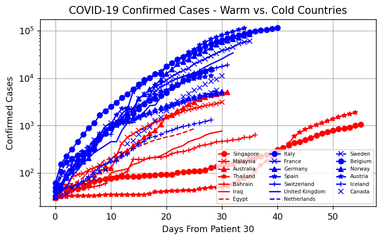
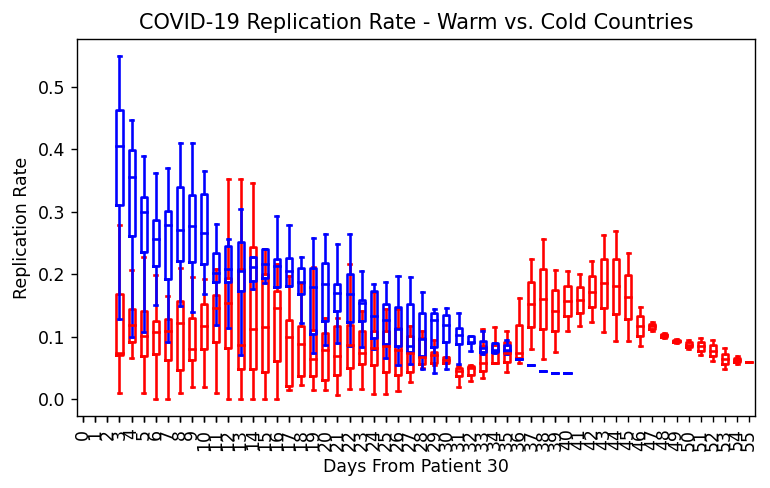
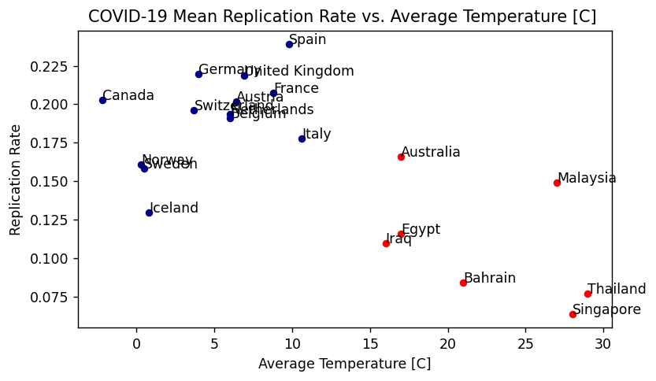
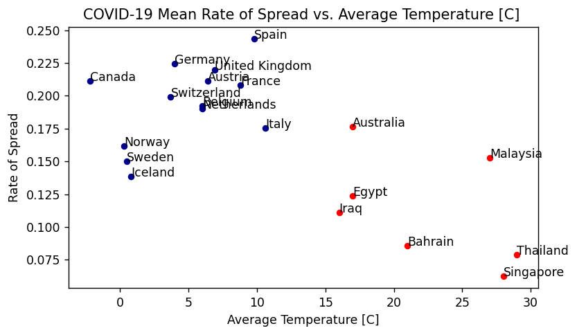
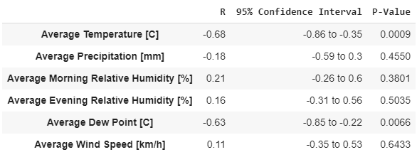
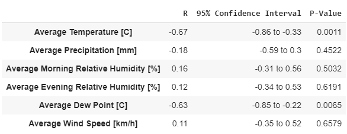

# Climate effect on COVID-19 spread rate : an online surveillance tool 
Updated at: 29/03/2020  
COVID-19 confirmed cases updated at: 28/03/2020   

### Confirmed Cases in "warm" vs. "cold" climate countries 

### Replication rate in "warm" vs. "cold" climate countries box-plot

### Rate of spread  in "warm" vs. "cold" climate countries box-plot

### Country replication rate and correlation to average climate parameters 
 
 

### Pearson correlation tables
#### Replication Rate & Climate Parameters
  
#### Rate of Spread & Climate Parameters 
  
